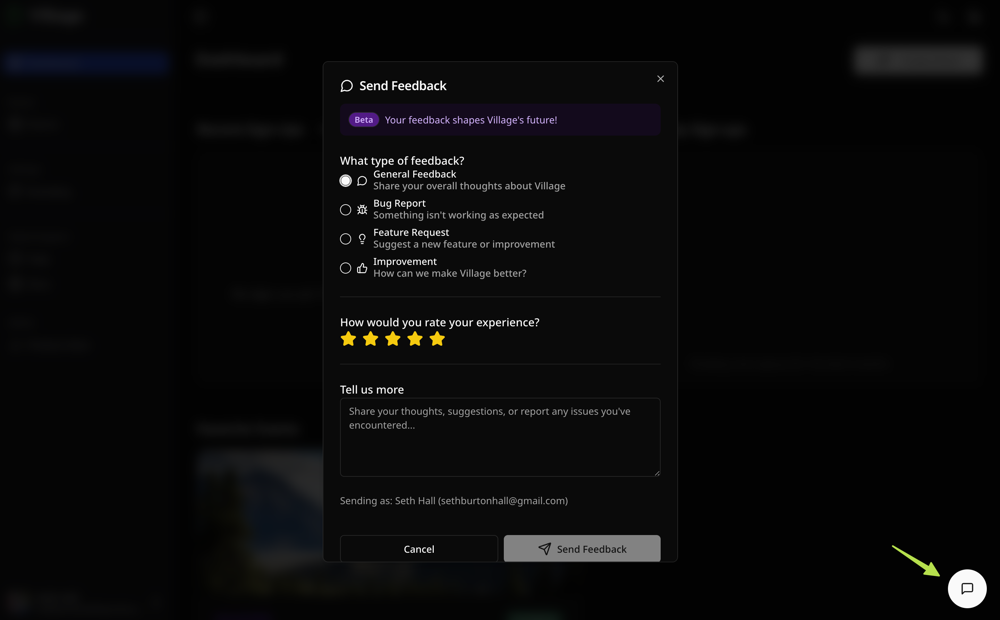

import { Image } from "astro:assets";
import helpMenu from "@/assets/screenshots/feedback-support/help-nav.png";

Village is in active development. Your feedback is one of the most valuable things you can provide — it directly shapes what gets built, fixed, and prioritized next.

There are several ways to get help or share feedback from within the app.

---

## In-app feedback button

A **feedback button** is always visible in the bottom-right corner of the app. Click it at any time to open the feedback form.

The form includes:

- **Type** — choose a category for your feedback:
  - _General_ — anything that doesn't fit another category
  - _Bug Report_ — something isn't working as expected
  - _Feature Request_ — something you'd like Village to add
  - _Improvement_ — a suggestion to make an existing feature better
- **Rating** — rate your experience on a 1–5 star scale
- **Message** — describe the issue, idea, or observation in your own words

Every message is read by the Village team. Don't hold back — even small observations are helpful.

---

## Help Center

Click **Help** in the sidebar navigation to open the Help Center. From there you can:

- **View Help Articles** — quick link to these docs
- **Contact Support** — reach the Village support team directly through the feedback form
- **Retake the Tour** — replay the welcome tour that introduces Village's core features

<Image src={helpMenu} alt="A book with a diagram on it" data-zoom-off />

---

## Useful links

|             |                                                    |
| ----------- | -------------------------------------------------- |
| **App**     | [app.usevillage.app](https://app.usevillage.app)   |
| **Website** | [usevillage.app](https://usevillage.app)           |
| **Docs**    | [docs.usevillage.app](https://docs.usevillage.app) |

---

## What's coming :badge[Beta]{variant=caution}

Beta users can help shape the future of Village by providing feedback on upcoming features.

These features are being considered for future updates:

- **Team management** — invite team members to help manage events
- **Granular role permissions** — control what each team member can view and edit
- **SMS notifications** — text message reminders and confirmations for attendees
- **Event analytics** — sign-up trends, conversion rates, and attendance insights

Have a strong opinion about what should come first? Use the in-app [feedback form ](/guides/feedback-support/#in-app-feedback-button) to let us know directly.

---

## Troubleshooting common issues

**My event public page isn't showing up.**
Make sure your event is published, not in draft status. Draft events are not listed in the public-facing view, but you can see them on your Events page. Check that the yellow "Draft" badge is not showing on the event card.

**Attendees say they didn't receive a confirmation email.**
Ask them to check their spam or junk mail folder. Confirmation emails are sent immediately after sign-up. If the issue persists, contact support.

**I can't create more than 3 events.**
The Free plan allows up to 3 published events at a time. To publish a new event, either delete or cancel one of your existing published events to free up a slot, or [upgrade](/start-here/account-plans) for unlimited events.

**The sign-up form is showing "event is full."**
All available slots have been filled. You can increase the slot count by editing the event. If you remove an attendee, their slot is automatically returned.

**I made an edit and all my attendees got an email.**
This is expected behavior — Village sends an event update notification to all existing sign-ups whenever a published event's title, short description, or date/time is changed. To minimize notifications, batch all your changes and save once.
