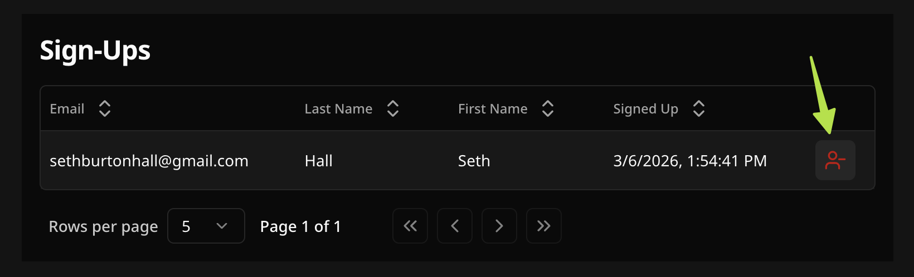

import { Aside } from "@astrojs/starlight/components";
import { Badge } from "@astrojs/starlight/components";

When attendees sign up for your event, their sign-ups appear in the sign-up table on your event's detail page. Village updates this table in real time — you don't need to refresh the page to see new registrations.

---

## Viewing sign-ups

```
https://app.usevillage.app/events/[eventId]
```

To see sign-ups for a specific event:

1. Go to **Events** in the sidebar
2. Click _**View Event**_ to open its detail page
3. Scroll down to the **Sign-Ups** section

The sign-up table displays one row per attendee. It displays the attendee's **name**, **email**, **date signed up**, and any **additional fields** you added to your sign-up form.

If no one has signed up yet, the section shows an empty state with a message indicating sign-ups will appear here when people register.

### Slot-based events

For **Appointment**, **Volunteer Shift**, and **Bring an Item** events, sign-ups are grouped by slot instead of shown in a flat table. Each slot appears as its own card with:

- The slot label, date, and time (or item name)
- A **fill rate badge** showing how many spots are filled out of the total (e.g. **3 / 5**) — shown in red when the slot is full
- The list of attendees signed up for that slot

This makes it easy to see at a glance which slots still have availability and who is assigned to each one.

---

## Real-time updates

Village updates your event data live — no page refresh needed. This applies to:

- **Sign-up table** — new registrations appear as rows the moment someone submits the form
- **Slot counter** — the available slot count on your event detail page decreases in real time as spots are taken (and increases when a sign-up is removed or cancelled)
- **Public sign-up page** — attendees see the current available slot count live, so they always know if spots are still open
- **Event Analytics** — the Recent sign-ups feed and Top events list on the dashboard also update automatically <Badge text="Organization" variant="tip" />

This makes Village useful for active check-in scenarios — open your event on a tablet at the door and see arrivals as they register.

---

## Removing a sign-up

To remove an attendee from an event:

1. Open the event's detail page
2. Find the attendee in the sign-up table
3. Click the **remove icon** (person with a minus sign) at the end of their row
4. A confirmation dialog appears



In the confirmation dialog, you can:

- Choose whether to **notify the attendee by email** (checked by default)
- Add an optional **personal note** to include in the notification email (e.g. "Removed you from the event per our previous conversation — please reach out if you have questions.")

Click **Remove** to confirm. The attendee's slot is immediately returned to the event's available count, and if you chose to notify them, they receive an email.

<Aside>
  **Note:** The sign-up record is kept in your data for historical reference,
  but the attendee's slot is freed and they can no longer manage their
  registration via their confirmation email link.
</Aside>

---

## Attendee self-cancellation

Attendees can cancel their own spot without contacting you. Every sign-up confirmation email includes a link to manage their signup. When an attendee clicks it, they're taken to a page where they can:

- Review the event details and their form responses
- Click _**Cancel my spot**_ to remove themselves from the event

When they cancel, their slot is immediately returned to the event. You don't need to take any action. See [Email Notifications](/guides/email-notifications/#5-attendee-self-cancellation) for more details on the confirmation email.

## Checking in attendees

The check-in column is off by default. Enable it per-event when you need it — for example, when running an in-person event and want to mark attendees as they arrive.

To enable check-in mode and start checking people in:

1. Open the event's detail page
2. In the **Sign-Ups** section, click the **Green Check** toggle button to turn it on (it turns green when active)
3. A **Checked In** column appears at the left of the table
4. Click the **circle icon** next to an attendee's name to mark them as present

The icon turns green to confirm the check-in. Click it again to remove the check-in if needed. The setting persists — if you leave the page and come back, check-in mode will still be on.

<Aside>
  Check-ins update in real time — open your event on a tablet at the door and
  mark attendees as they arrive. Any device viewing the same event page will
  reflect the change immediately.
</Aside>

---

## Exporting sign-ups to CSV :badge[Organization]{variant="tip"}

Organization plan users can download all sign-ups for an event as a CSV file.

1. Open the event's detail page
2. Go to the **Sign-Ups** section
3. Click the **Export CSV** button

<Aside>
  The downloaded file includes all form response columns, the sign-up
  timestamp, and a **Checked In At** timestamp for each attendee (blank if not
  checked in). Open it in Excel, Google Sheets, or any spreadsheet application.
</Aside>

---

## Event Analytics :badge[Organization]{variant="tip"}

Organization plan users also see sign-up activity on their dashboard:

- **Recent sign-ups** — a live-updating feed of the latest registrations across all of your events, with the attendee name, event title, and time
- **Top events by sign-ups** — a ranked list of your events sorted by total sign-up count

---

## Tips for managing sign-ups

- **Check in attendees** — use the **Checked In** column in the sign-up table to mark attendees as they arrive. Open the event on a tablet at the door for a live check-in view.
- **Use the search** — if your event has many sign-ups, use the table's built-in search to quickly filter for a specific name or email.
- **Remove vs. cancel** — removing a sign-up from your side and an attendee self-cancelling have the same effect: the slot is freed. The difference is who initiates it.
