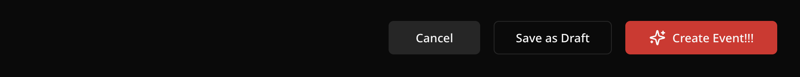
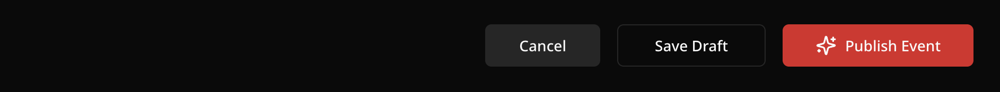
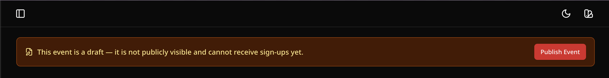

import { Aside } from "@astrojs/starlight/components";
import { Badge } from "@astrojs/starlight/components";
import { Image } from "astro:assets";
import updateStatus from "../../../assets/screenshots/publish-sharing/update-status.png";
import evenActionsMenu from "../../../assets/screenshots/publish-sharing/event-actions.png";

Once your event is ready, publishing it makes it live on the internet with a unique sign-up link that anyone can use — no Village account required.

---

## Publishing your event

There are two ways to publish an event:

### Event Form

```
https://app.usevillage.app/events/create
```

At the bottom of the event creation form, click _**Create Event**_. Your event goes live immediately and you'll see a confirmation.



### Event Draft Edit Form

```
https://app.usevillage.app/events/edit/[event-id]
```

If your event is saved as a draft, click _**Publish Event**_ at the bottom of the event draft edit form. Your event goes live immediately and you'll see a confirmation.



### Event Draft Mode

```
https://app.usevillage.app/events/[event-id]
```

If your event is saved as a draft, click _**View Event**_ to open it from your Events list. Look for the yellow draft banner at the top of the page. Click _**Publish Event**_ to make it live instantly — no need to go back into the edit form.



## Your event's public link

Every published event has a unique public URL:

```

https://app.usevillage.app/event-signup/[event-id]

```

You can find and copy this link in two ways:

- Open the event actions elipsis (...) menu on any event card or event detail page
  - Click _**View Public Link**_ to open the event page. Copy the url in address bar.
  - Click _**Copy Public Link**_. to copy the link to your clipboard.

<Image
  src={evenActionsMenu}
  alt="Event actions menu with copy and view options"
  class="img-sm"
  data-zoom-off
/>

---

## What attendees see on the public page

When someone opens your event's public link, they see:

- Your event's **cover image** and **color theme**
- The **event title** and **event type**
- The **date and time** (with end time, if set)
- The full **description** with all of your rich text formatting
- For **Standard** events: the **number of remaining slots** (if the event has a slot limit)
- For **Appointment**, **Volunteer Shift**, and **Bring an Item** events: a **slot picker** showing each available slot as a card — attendees select one before filling out the form
- Your **sign-up form**
- Your **organization name and logo** <Badge text="Organization" variant="tip" />

<Aside>
  Attendees do not need a Village account to sign up. They simply fill out the
  form and submit.
</Aside>

---

## Slot availability

### Standard events

The public page shows a live count of remaining slots. As people sign up, the count decreases in real time.

When **all slots are filled**, the sign-up form is automatically replaced with an "event is full" message. No action is needed on your part.

If someone cancels or you remove an attendee, their slot is immediately returned and the form reopens for new sign-ups.

### Slot-based events (Appointment, Volunteer Shift, Bring an Item)

Instead of a single slot count, attendees see a **slot picker** — a grid of cards, one per slot. Each card shows:

- The slot label, date, and time (Appointment and Volunteer Shift)
- The item name and quantity remaining (Bring an Item)
- A live availability badge (e.g. **Available**, **2 left**, **Last spot**)

Attendees click a card to select their slot before filling out the sign-up form. Full slots are grayed out and cannot be selected. If every slot is full, a message is shown and no new sign-ups can be submitted.

As with standard events, availability updates in real time — no refresh needed.

---

## Event status

You can change your event's status at any time. Status options are:

| Status                                         | What it means                                              |
| ---------------------------------------------- | ---------------------------------------------------------- |
| <Badge text="In Progress" variant="success" /> | Your event is active and accepting sign-ups                |
| <Badge text="Canceled" variant="danger" />     | The event is canceled — the card is visually de-emphasized |

Events that have passed their date are automatically displayed as <Badge text="Completed" /> in your dashboard with a grayed-out appearance. No action is required.

To change the status, use the _**Event Status**_ selector on the edit form or the **event status badge** on the event.

<Image
  src={updateStatus}
  alt="Update Status Selector Badge"
  class="img-sm"
  data-zoom-off
/>

---

## Editing a published event

You can edit any event detail at any time after publishing.

<Aside type="tip" title="Important">
  When you edit the event **title**, **short description**, or **date/time**,
  Village automatically sends an **event update email** to all existing
  sign-ups. Make sure your changes are intentional before saving, as this will
  notify everyone who has already signed up. See [Email
  Notifications](/guides/email-notifications) for details on what that email
  contains.
</Aside>

## Duplicating an event

To reuse an event as a starting point for a new one, open the event actions elipsis (...) menu on any event card or event page and click _**Duplicate**_. Village creates an exact copy of the event and opens it in the editor as a new draft for you to customize.

<Aside>
  This is useful for recurring events where most details stay the same each
  time.
</Aside>

---

## Deleting an event

To permanently delete an event, open the event actions elipsis (...) menu and click _**Delete**_. A confirmation dialog will appear before anything is removed.

<Aside>
  Deleting an event does not automatically notify attendees. If you want to
  notify attendees before deleting a published event that has sign-ups, change
  its status to _**canceled**_ before deleting it, and attendees will be
  notified by email.
</Aside>

<Aside type="danger" title="Warning">
  Deletion is permanent and cannot be undone.
</Aside>

## Marking as a Favorite

Click the ⭐ **star icon** on any event card to favorite it. Favorited events appear in the _**Favorite events**_ section at the top of your _**Dashboard**_ for quick access. Click the ⭐ **star icon** again to unfavorite.
